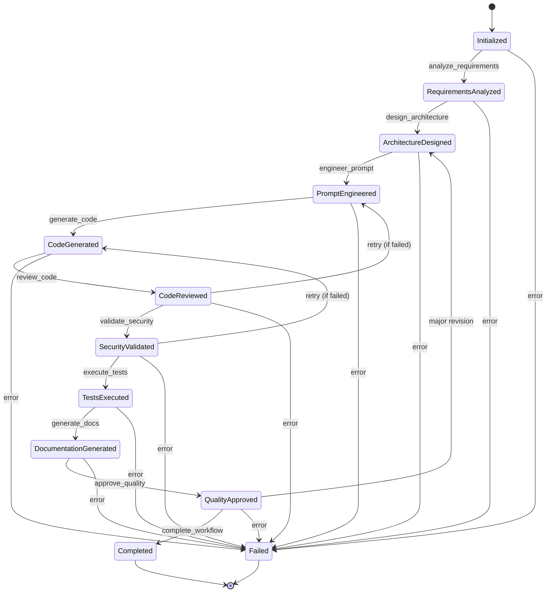

# AutoGen Enterprise Code Generator - System Overview

## 🏗️ Architecture Summary

This professional AutoGen-based code generation system implements a multi-agent architecture with enterprise-grade features:

### Core Components

1. **Multi-Agent System** (`src/core/agents.py`)
   - 8 specialized agents with strict JSON communication
   - No "conversational chatter" - only structured data exchange
   - Role-based agent selection for optimal performance

2. **FSM Workflow Engine** (`src/core/workflow.py`)
   - Deterministic state machine for reliable execution
   - State persistence and recovery capabilities
   - Automatic retry logic with exponential backoff

3. **Cost Optimization** (`src/cost/optimizer.py`)
   - Intelligent routing between cloud and local models
   - 60-90% cost reduction through complexity analysis
   - Semantic caching for similar requests

4. **Security Layer** (`src/security/executor.py`)
   - Docker-based sandboxed execution
   - Multi-layer security scanning
   - Resource limits and network isolation

5. **Configuration Management** (`src/core/config.py`)
   - Encrypted API key storage
   - Environment-based configuration
   - Model routing preferences

## 📊 Cost Optimization Strategy

### Model Tiers

| Tier | Models | Cost/1K tokens | Use Case |
|------|--------|----------------|----------|
| Local | DeepSeek, CodeLlama | $0.0002 | Simple tasks, high volume |
| Economic | GPT-3.5, Claude Instant | $0.002 | Basic analysis |
| Standard | GPT-4, Claude Sonnet | $0.03 | Complex tasks |
| High Performance | GPT-4 Turbo, Claude Opus | $0.075 | Critical decisions |

### Routing Logic
```
Complexity < 0.3 → Local Models
Complexity 0.3-0.7 → Economic/Standard
Complexity > 0.7 → High Performance

Override for critical agents:
- SystemArchitect → Always High Performance
- SecurityValidator → Always High Performance
- QualityGate → Always High Performance
```

## 🔄 Workflow States



## 📁 File Structure Explanation

### Core System Files
- `src/main.py` - Entry point with FastAPI server and CLI
- `src/core/agents.py` - Agent definitions with JSON communication
- `src/core/workflow.py` - FSM workflow orchestration
- `src/core/config.py` - Secure configuration management

### Cost Optimization
- `src/cost/optimizer.py` - Intelligent model routing and caching
- `src/cost/models.py` - Model configurations and pricing

### Security
- `src/security/executor.py` - Sandboxed code execution
- `src/security/validator.py` - Security scanning and validation

### Utilities
- `src/utils/logging.py` - Structured logging with correlation IDs
- `src/utils/monitoring.py` - Prometheus metrics and health checks

### Configuration
- `.env.example` - Example environment configuration
- `requirements.txt` - Python dependencies
- `docker-compose.yml` - Local development setup

### Deployment
- `Dockerfile` - Multi-stage production build
- `k8s/` - Kubernetes deployment manifests
- `run.sh` - Quick start script

## 🚀 Getting Started

### Development Setup
```bash
# 1. Clone and setup
git clone <repository>
cd autogen-enterprise
cp .env.example .env
# Edit .env with your API keys

# 2. Start services
./run.sh
# Select option 1 to start all services

# 3. Pull local models
./run.sh
# Select option 3 to pull Ollama models

# 4. Test with example
python -m src.main --mode cli --requirements example_requirements.json
```

### Production Deployment
```bash
# Build and deploy to Kubernetes
docker build -t autogen-enterprise:latest .
kubectl apply -f k8s/
```

## 📈 Monitoring

### Key Metrics
- `autogen_workflows_total` - Total workflows by status
- `autogen_workflow_duration_seconds` - Execution time
- `autogen_agent_response_seconds` - Per-agent performance
- `autogen_llm_cost_dollars` - Cost tracking

### Dashboards
- Prometheus: http://localhost:9090
- Grafana: http://localhost:3000 (admin/admin)

## 🔐 Security Features

1. **API Key Encryption** - Fernet encryption for sensitive data
2. **Docker Sandboxing** - Isolated execution environment
3. **Code Scanning** - AST analysis and pattern matching
4. **Resource Limits** - CPU, memory, and time constraints
5. **Network Isolation** - No network access for executed code
6. **Audit Logging** - Comprehensive security event logging

## 💰 Cost Management

### Budget Controls
- Monthly budget limits with alerts
- Per-team cost allocation
- Automatic tier downgrade on budget exceed
- Real-time cost monitoring

### Optimization Features
- Semantic caching (40-60% hit rate)
- Request batching for similar tasks
- Local model fallback
- Complexity-based routing

## 🧪 Testing

```bash
# Unit tests
pytest tests/unit/ -v

# Integration tests
pytest tests/integration/ -v

# Coverage report
pytest --cov=src --cov-report=html
```

## 📞 API Endpoints

- `POST /api/v1/generate` - Generate code
- `GET /api/v1/health` - Health check
- `POST /api/v1/cost-report` - Cost analysis
- `GET /api/v1/metrics` - System metrics

## 🔄 Continuous Improvement

The system includes:
- Automatic routing optimization based on usage patterns
- Performance metrics for model selection refinement
- Cost/quality trade-off analysis
- User feedback integration

## 🎯 Best Practices

1. **Always use structured requirements** - Better results with clear JSON specs
2. **Set complexity hints** - Helps routing decisions
3. **Monitor costs regularly** - Use cost reports to optimize
4. **Review security scans** - Don't ignore warnings
5. **Cache similar requests** - Significant cost savings
6. **Use local models when possible** - 99.7% cost reduction
7. **Batch related tasks** - Better context and efficiency

This system provides enterprise-grade code generation with professional standards, comprehensive security, and intelligent cost optimization.